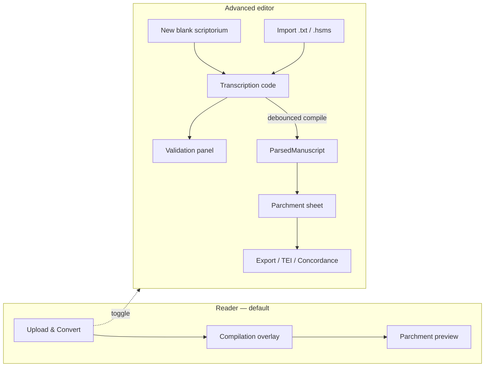

# HSMS Editor and Builder

How **Transcription Conniption** turns plain-text [HSMS](https://hispanicseminary.org/manual-en.htm) diplomatic transcriptions into a live, editable scriptorium workspace — with validation, facsimile attachments, and export.

> **Markup rules:** [HSMS-manual.md](HSMS-manual.md) · [hispanicseminary.org/manual-en.htm](https://hispanicseminary.org/manual-en.htm)  
> **Parse pipeline:** [ARCHITECTURE.md](ARCHITECTURE.md) · **Page layout:** [HSMS-LAYOUT.md](HSMS-LAYOUT.md) · **Facsimile typography:** [HSMS-TYPOGRAPHY.md](HSMS-TYPOGRAPHY.md)

---

## 1. What the editor/builder does

Transcription Conniption is not a WYSIWYG word processor. It is a **line-faithful HSMS studio**:

| Layer | Role |
|-------|------|
| **Source editor** | Multiline `TextInput` for the raw `.txt` transcription (one HSMS source line per manuscript line) |
| **Compiler** | Three-pass parse → `ParsedManuscript` AST on every debounced edit |
| **Preview builder** | Renders the AST as a parchment leaf (React Native text layout or optional SVG facsimile) |
| **Scriptorium workspace** | Persists transcription, title, figure images, folio scans, and free placements on device |
| **Scholarly outputs** | Validation, KWIC concordance, TEI-XML, legacy HTML, `.hsms` bundles, raster/SVG export |

The default experience is **reader-first** (upload and scroll). **Advanced editor** unlocks the full builder toolchain without changing the underlying HSMS contract.

---

## 2. Two workflows



### 2.1 Reader workflow (convert-and-read)

1. Tap **Upload & Convert** (or drag-and-drop a `.txt` file on web).
2. `CompilationOverlay` shows progress while `compileManuscriptTree()` runs synchronously.
3. Publication metadata from `{RMK: …}` lines appears in a card **above** the leaf — never duplicated inside the folio body.
4. Scroll the parchment; diplomatic display toggles stay hidden until **Advanced editor** is enabled.

Best for: checking an OSTA file, Pedro Nunes regression corpus, or a finished transcription.

### 2.2 Scriptorium workflow (edit-and-build)

1. Toggle **Advanced editor** on the Studio tab (`app/(tabs)/index.tsx`).
2. Choose a starting point:
   - **New blank scriptorium** — loads `BLANK_SCRIPTORIUM_TEMPLATE` from `constants/workspaceTemplates.ts`
   - **Import .hsms** — restores transcription + embedded base64 assets
   - **Upload & Convert** / samples — loads text into the active workspace
3. Switch to **Transcription code** to edit HSMS source; **Parchment sheet** to preview layout.
4. Fix validation issues, attach facsimiles, tune display toggles, export.

Best for: authoring, correcting structure, attaching figure scans, batch-validating OSTA folders.

---

## 3. UI modes and state

The Studio screen separates **global workspace state** (context) from **local UI state** (screen).

### 3.1 Mode flags

| Flag | Default | Meaning |
|------|---------|---------|
| `isEditorMode` | `false` | When false, hides editor chrome, toggles, concordance, batch tools |
| `isPreview` | `true` | In editor mode: false = HSMS `TextInput`; true = parchment preview |
| `showParchment` | `isPreview \|\| !isEditorMode` | Reader always sees the leaf |
| `showReaderTools` | `isEditorMode` | Display toggles, scholar toolbar, concordance |

```text
Reader only:     isEditorMode=false  →  parchment always visible, no code editor
Editor + code:   isEditorMode=true, isPreview=false  →  ValidationPanel + TextInput
Editor + sheet:  isEditorMode=true, isPreview=true   →  toggles + parchment + tools
```

Switching to **Parchment sheet** calls `commitEditorBuffer()` so the latest keystrokes enter the debounced compile pipeline before preview.

### 3.2 Display toggles (preview only)

Available when `showReaderTools` is true:

| Toggle | Effect on preview |
|--------|-------------------|
| Expansions (`<>`) | Show or hide `<expansion>` text (brown italic in SVG) |
| Deletions (`()`) | Strikethrough scribal/editorial deletions |
| Unicode diacritics | Prefer `token.normalized` (`õ`) over diplomatic (`o~`) |
| Hide otiose `~` | Suppress standalone tilde marks |
| Reading flow | Show hyphen-stitched continuous prose panel |
| Synoptic pane | Split diplomatic + normalized columns (viewport ≥ 640 px) |
| Facsimile canvas | Folio leaf scans with tap-to-place fragments |
| Place figure | Enable free `FacsimilePlacement` pins on canvas |
| SVG canvas | Use `SvgFacsimilePage` instead of RN `Text` layout |

Toggle values flow through `ReaderStateContext` into `TokenStream`, `BlockFigureLayout`, and `SvgFacsimilePage*`.

### 3.3 Paleographic brackets and lacunae

The lexer (`utils/hsmsLexer.ts`) distinguishes bracket forms that editors often conflate:

| Source | Token | Preview behaviour |
|--------|-------|-------------------|
| `[*text]` | `reconstructed_text` | Italic green `[text]` — damaged script, editor reconstruction |
| `[??]` / `[???]` | `illegible_text` | □□ — ink present but unreadable |
| loose `??` (often line-final) | `missing_fragment` | … — torn margin / binder trim |
| `[ ]` / `[]` | `mechanical_lacuna` | Preserved word space (no clumping) |
| `[supplied]` (no `*`) | `editorial_insertion` | Brown italic editorial supply |

Rule order in `TOKEN_RULES` ensures `[*…]` and `[??]` are not captured as generic `[…]` insertions.

### 3.4 Drop initials (`{INn.}`)

`{INn.}` marks a **multi-line illuminated box**, not a multi-letter string inside it. The parser peels **one historiated grapheme** into `drop_initial`; remaining letters of the opening particle stay in the body tokens:

| Source line | Cap token | Body begins |
|-------------|-----------|-------------|
| `{IN5.} EU el Rey…` | `E` | `U el Rey…` |
| `{IN4.} AO muyto…` | `A` | `O muyto…` |
| `{IN4.} SPhera…` | `S` | `Phera…` |

On the **SVG canvas**, `stripDropCapPrefixFromSegs()` removes any duplicated cap grapheme from the first justified segment before micro-tracking runs (`SvgFacsimilePage.web.tsx`, `SvgFacsimilePage.tsx`). Regression: `__tests__/hsmsPaleography.test.ts`.

---

## 4. Scriptorium workspace model

Persistent state lives in `ScriptoriumProvider` (`context/ScriptoriumContext.tsx`) and `utils/scriptoriumWorkspace.ts`.

### 4.1 Workspace record

```typescript
ScriptoriumWorkspace {
  id: string                    // ws_<timestamp>_<random>
  manuscriptTitle: string       // inferred from {RMK:} or filename
  sourceFileName?: string
  transcriptionText: string     // authoritative HSMS source
  assetMap: Record<string, string>       // figureId → local file URI
  folioBackgrounds?: Record<string, string>
  freePlacements?: FacsimilePlacement[]
  createdAt / lastModified: ISO strings
}
```

Index key: `hsms.scriptorium.workspaces.v1` in AsyncStorage. Figure JPEG/PNG files copy to:

```text
documentDirectory/scriptorium/<workspaceId>/figures/<figureId>.<ext>
documentDirectory/scriptorium/<workspaceId>/folios/bg_<folioId>.<ext>
```

### 4.2 Editor buffers and compile timing

```text
localEditorBuffer  ──onChange──►  (immediate UI)
       │
       └── commitEditorBuffer / debounce 400 ms ──►  editorBuffer
                                                          │
                                                          ▼
                                              debouncedText
                                                          │
                                                          ▼
                                    compileManuscriptTree(debouncedText)
                                                          │
                                                          ▼
                                              parsedManuscript
```

| Signal | Meaning |
|--------|---------|
| `isParsing` | `localEditorBuffer !== debouncedText` — spinner in code view |
| `isCompiling` | File or `.hsms` import in progress — full-screen overlay |
| `parsedManuscript` | Latest AST + stats + concordance + validation errors |

Import paths (`importTextFile`, `importHsmsBundle`) set `isCompiling` and yield one frame before synchronous compile so the overlay can paint.

### 4.3 Batch registry

After **Batch folder** completes, compiled witnesses land in `ManuscriptRegistry`:

```typescript
ManuscriptRegistry = Record<fileName, {
  rawText: string
  parsedTree: ParsedManuscript
  uploadedImages: Record<string, string>
}>
```

`ManuscriptSelector` switches the active witness without losing batch results. Selection updates `activeFileName` and reloads editor buffers from the registry entry.

---

## 5. Building from source

### 5.1 What “build” means

There is no separate build artifact checked into the repo. **Build = compile**:

```
Raw .txt  →  compileManuscriptTree()  →  ParsedManuscript
                ├── metadata ({RMK:})
                ├── folios[] (blocks, tokens, headings)
                ├── stats (words, lines, rubrics, glosses)
                ├── concordance (KWIC index)
                └── validationErrors
```

Optional spatial phase for facsimile renderers:

```
FolioSide  →  buildSpatialFolio()  →  ColumnBlock[]  →  Line[]
```

See [ARCHITECTURE.md § Core domain](ARCHITECTURE.md) and [HSMS-LAYOUT.md](HSMS-LAYOUT.md).

### 5.2 Authoring skeleton

**New blank scriptorium** seeds:

```text
{RMK: Author Name.}
{RMK: Manuscript Title.}
[fol. 1r]
{HD. Running header}
{CB1.
1 {IN3.} I In cipit prologus…
}
```

Edit `{RMK:}` lines for publication metadata, add folio markers, column blocks, and inline markup per the HSMS manual.

### 5.3 Built-in samples

| Sample key | Purpose |
|------------|---------|
| **Nunes demo** | Full Pedro Nunes *Tratado da sphera* markup (`DEFAULT_DEMO`) |
| **Simple** | Light folio + rubric example |
| **LAT span** | Nested `{LAT.}` language environment |
| **Graphics** | `{ILL.}`, `{MIN.}`, `{DIAG.}` figure anchors |

Samples call `loadSample()` → replace workspace transcription → compile → open parchment preview.

---

## 6. Validation and navigation

### 6.1 Validation sources

`enrichParsedManuscript()` merges errors from:

| Check | Module |
|-------|--------|
| Line lexical (unclosed `<`, `(`, `[`) | `utils/parseValidation.ts` |
| Structural brace balance per line | `scanStructuralTokenIssues` (env stack) |
| Multi-line environment continuation | `utils/validation.ts` |
| Stray `}` / folio-before-close | `utils/validation.ts` |

### 6.2 Validation UI

- **EditorLinterBanner** — instant structural lint on the live editor buffer (no full compile); use before switching to parchment / SVG.
- **ValidationPanel** — merged diagnostics after debounced compile (parse-time + lint); tap a row → jump to line on parchment via `ScrollAnchorProvider`.
- **Errors (N) toolbar button** — opens `app/modal.tsx` full validation sheet.
- Green banner when `validationErrors` is empty.

Concordance hits use the same scroll anchor system (`navigateToAnchor`, `navigateToLineIndex`).

---

## 7. Facsimile builder

### 7.1 Figure slots

Parser allocates stable `figureId` keys (`<folioId>_fig_NNN`) for `{ILL.}`, `{MIN.}`, `{DIAG.}`, `{SYMB.}` tokens. In preview:

- **FigurePlaceholder** — tap margin/inline slots to upload JPEG/PNG/WebP
- Images copy into workspace storage; URIs persist in `assetMap`
- **Replace** / **Remove** controls when a slot is filled

### 7.2 Folio canvas

When **Facsimile canvas** is on:

- Upload a full-leaf scan per folio (`setFolioBackground`)
- **Place figure** mode adds free `FacsimilePlacement` pins at tap coordinates (`FolioFacsimileCanvas`)

Both are included in `.hsms` bundle export.

---

## 8. Export and interchange

### 8.1 Quick export sheet

**Export** opens `ExportManuscriptSheet` with format picker:

| Format | Output |
|--------|--------|
| `.txt` | Raw HSMS source |
| `.html` | Legacy-styled document (`utils/htmlExport.ts`, spatial `{CB2.}` zip) |
| `.svg` | Standalone SVG facsimile document |
| `.png` / `.jpg` / `.webp` | Raster snapshot of preview (web) |

Filename extension infers format; web uses download, native uses share sheet (`utils/exportFile.ts`).

### 8.2 TEI export

**TEI export** builds TEI P5 XML (`utils/teiExport.ts`) and opens the system share sheet.

### 8.3 `.hsms` scriptorium bundle

Portable workspace archive (`utils/hsmsBundle.ts`):

```json
{
  "manifest": { "format": "hsms-scriptorium-bundle/1", "workspace": { … } },
  "assets": { "<figureId>": { "mime": "image/jpeg", "base64": "…" } },
  "folioBackgrounds": { … }
}
```

- **Export .hsms** — embeds all attached images as base64
- **Import .hsms** — restores workspace, writes assets to local storage, re-compiles

Use bundles to move a witness between devices or back up figure attachments with the transcription.

---

## 9. Batch compiler

**Batch folder** (`ResponsiveBatchShell` + `BatchProcessingPanel`) compiles many `.txt` files sequentially:

1. Pick multiple plain-text files (e.g. an OSTA `transcriptions/` folder).
2. `processTranscriptionBatch()` runs `compileManuscriptTree` per file with ~16 ms UI yields.
3. Progress list shows words, lines, and anomaly counts per file.
4. On complete, results populate `ManuscriptRegistry`; switch witnesses via **ManuscriptSelector**.

Failed files record error messages without aborting the rest of the batch.

### 9.1 Headless OSTA batch (CLI)

For full-corpus regression outside the app, use the sibling [OSTA](https://github.com/hispanicseminary/OSTA) checkout:

```bash
npm run batch:osta
npm run report:osta   # re-aggregate only
```

Each transcription under `OSTA/transcriptions/` produces in `out/` (gitignored):

| Artifact | Purpose |
|----------|---------|
| `<name>.html` | Legacy-style HTML export for spot checks |
| `<name>.native.ts` | HSMS source + compile-at-load AST (`hsms-native-bundle/2`; transcription only on disk) |
| `<name>.issues.log` | Per-witness issue log (three sections below) |
| `issues-summary.txt` | Prioritized aggregate across all logs |
| `issues.json` | Machine-readable summary (lint / parse / render counts and codes) |

**Issue log sections** (`formatIssueLog` in `utils/ostaBatchConverter.ts`):

| Section header | Tag | Module |
|----------------|-----|--------|
| `=== PRE-COMPILE LINT (hsmsLinter) ===` | `[LINT]` | `lintHsmsTranscription` — folio markers, env stack, `[*]` / `[ ]` lacuna conventions |
| `=== COMPILE / PARSE VALIDATION ===` | `[PARSE]` | `compileManuscriptTree` validation (deduped against lint keys) |
| `=== RENDER / HTML LEAKAGE (post-export scan) ===` | `[RENDER]` | `scanRenderedMarkupLeakage` in `utils/renderMarkupLeakage.ts` |

**Render leakage scan** walks exported parchment HTML for HSMS markup that should have been consumed at export time: brace mnemonics (`{CB.}`, `{IN.}`, `{RMK:}`), raw reconstruction `[*…]`, stray editorial `[x]` fragments, long bracket runs, calderón `%`, and similar. It uses bounded regexes and a linear bracket-clump scanner to avoid catastrophic backtracking on large exports.

**Batch performance:** OSTA batch calls `scanRenderedMarkupLeakage(..., { skipLacunaChecks: true })`, which omits the `\[\s+\]` lacuna HTML pattern and **skips the per-token tree walk** entirely (lacuna-heavy witnesses with hundreds of thousands of tokens were stalling corpus runs). Mechanical lacuna syntax is still covered by `[LINT]` when the pre-compile linter flags it. Full render scanning (including lacuna token checks) runs in unit tests and can be used from the app by calling the scanner without `skipLacunaChecks`.

Options: `--limit=N`, `--in <dir>`, `--out <dir>`, `--no-report`. Override default input with `OSTA_TRANSCRIPTIONS_PATH`. If `npm` treats `--limit` as an npm config flag, run `npx tsx scripts/batch-convert-osta.ts --limit=N` directly. Implementation: `utils/ostaBatchConverter.ts`, `utils/ostaIssueReport.ts`, `scripts/batch-convert-osta.ts`.

Integration tests that compile the same corpus live under `__tests__/integration/osta/` and run only via `npm run test:osta` (default `npm test` never touches OSTA files).

---

## 10. Scholarly tools (editor preview)

| Tool | Component / module | Notes |
|------|-------------------|-------|
| **Concordance** | `ConcordanceDrawer` + `utils/concordance.ts` | Virtualized KWIC; tap → scroll to folio/line |
| **Synoptic split** | `SynopticFolioSplit` + `utils/normalizedText.ts` | Diplomatic left, normalized right (wide layout) |
| **Reading flow** | `reconstructManuscriptFlow` | Hyphen-stitched prose across folio boundaries |
| **Stats** | `parsedManuscript.stats` | Words, lines, rubric/gloss counts in modal |

---

## 11. Web affordances

On web (`npm run start:web`):

- **Drag-and-drop** `.txt` anywhere on the Studio screen → same path as Upload & Convert
- **SVG facsimile** resolves to `SvgFacsimilePage.web.tsx` (HTML rows inside an SVG parchment shell)
- **Ornate drop caps** — one grapheme per `{INn.}` (e.g. `{IN4.} AO` → cap **A**, body **O…**); web: `HtmlOrnateDropCap`; native SVG facsimile: `renderOrnateInitialSvg` with four seeded style matrices (vines, criblé stipple, ribbon interlace, damask tessellation) — see [HSMS-TYPOGRAPHY.md §6](HSMS-TYPOGRAPHY.md); tap to replace with an uploaded folio scan
- Export uses browser download when the File System Access API is unavailable
- UI card shadows use `utils/platformShadow.ts` (`boxShadow` on web) to avoid React Native Web deprecation warnings

---

## 12. Related files

| Path | Role |
|------|------|
| `app/(tabs)/index.tsx` | Studio screen — modes, toggles, editor, preview orchestration |
| `context/ScriptoriumContext.tsx` | Workspace, registry, debounced compile, import/export |
| `context/ScrollAnchorContext.tsx` | Parchment scroll ref, line anchors, navigation |
| `constants/workspaceTemplates.ts` | Blank scriptorium skeleton |
| `components/EditorLinterBanner.tsx` | Live `lintHsmsTranscription` banner |
| `components/ValidationPanel.tsx` | Post-compile validation list |
| `utils/hsmsLinter.ts` | `lintHsmsTranscription` — env stack, folio leaks, CW/SG placement, `[*]` / `[]` checks |
| `utils/validation.ts` | Core single-pass structural validator |
| `scripts/lint-hsms.ts` | `npm run lint:hsms` CLI |
| `components/ConcordanceDrawer.tsx` | KWIC side drawer |
| `components/ManuscriptSelector.tsx` | Batch witness switcher |
| `components/ResponsiveBatchShell.tsx` | Batch UI (sidebar / full-screen modal) |
| `components/ExportManuscriptSheet.tsx` | Multi-format export picker |
| `components/FigurePlaceholder.tsx` | Tap-to-upload figure slots |
| `components/FolioFacsimileCanvas.tsx` | Leaf scan + free placements |
| `utils/compiler.ts` | `compileManuscriptTree` public entry |
| `utils/dropInitial.ts` | Single-grapheme `{INn.}` peel |
| `utils/hsmsLexer.ts` | Paleographic and editorial inline tokens |
| `__tests__/hsmsPaleography.test.ts` | Drop-cap grapheme + bracket/lacuna regression |
| `utils/hsmsBundle.ts` | `.hsms` import/export |
| `utils/batchProcessor.ts` | In-app multi-file compile loop |
| `utils/ostaBatchConverter.ts` | Headless OSTA batch (CLI) |
| `utils/ostaIssueReport.ts` | Issue log aggregation |
| `utils/renderMarkupLeakage.ts` | Post-render HTML leakage patterns and batch scan options |
| `scripts/batch-convert-osta.ts` | `npm run batch:osta` |
| `scripts/aggregate-osta-issues.ts` | `npm run report:osta` |
| `utils/scriptoriumWorkspace.ts` | AsyncStorage persistence |
| `utils/figureAssetStorage.ts` | Copy images into workspace directories |

---

## 13. Typical editing session

1. Enable **Advanced editor** → **New blank scriptorium** (or import existing `.txt`).
2. Stay in **Transcription code**; paste or type HSMS lines.
3. Watch **Validation** — fix unclosed environments, folio markers, lexical issues.
4. Switch to **Parchment sheet**; confirm drop caps, two-column zip, rubric colour.
5. Enable **SVG canvas** on web for legacy HTML parity checks against Pedro Nunes reference.
6. Attach figure scans at `{ILL.}` / `{MIN.}` placeholders.
7. **Export .hsms** to archive, or **Export** `.html` / **TEI export** for downstream tools.
8. Optional: run **Concordance** on lemma hits; jump to lines from KWIC rows.

---

## 14. Further reading

- [HSMS-manual.md](HSMS-manual.md) — authoritative markup reference (in-repo copy)
- [ARCHITECTURE.md](ARCHITECTURE.md) — full system design and extension points
- [HSMS-LAYOUT.md](HSMS-LAYOUT.md) — physical line model and SVG facsimile
- [HSMS-TYPOGRAPHY.md](HSMS-TYPOGRAPHY.md) — parchment aesthetics, ornate initials, paleographic rendering
- [OSTA corpus](https://github.com/hispanicseminary/OSTA) — regression transcriptions for batch compile

---

*This document describes Transcription Conniption editor/builder behaviour. HSMS transcription rules remain authoritative in the [published manual](https://hispanicseminary.org/manual-en.htm).*
