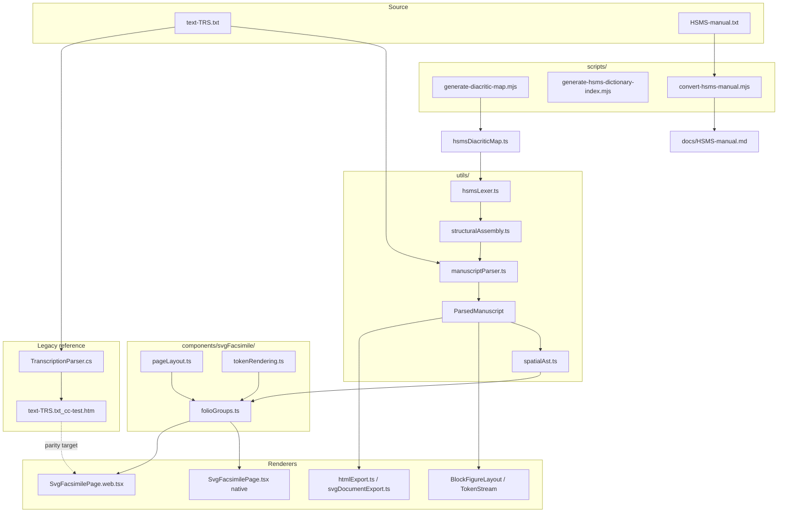

# HSMS Parsing and Spatial Layout

How line-based HSMS diplomatic transcriptions map onto the **graphically constrained writing area** of a manuscript or early printed page — and how Transcription Conniption implements that mapping.

> **Authoritative markup rules:** [HSMS *Manual of Manuscript Transcription* (English)](https://hispanicseminary.org/manual-en.htm) · In-repo copy: [HSMS-manual.md](HSMS-manual.md)  
> **Visual / typographic fidelity:** [HSMS-TYPOGRAPHY.md](HSMS-TYPOGRAPHY.md) — parchment aesthetics, ink semantics, ornate drop caps, paleographic rendering  
> **Reference corpus:** [OSTA on GitHub](https://github.com/hispanicseminary/OSTA)  
> **Worked example:** `../PedroNunes-TRS/text-TRS.txt` (Pedro Nunes, *Tratado da sphera*, 1537)  
> **Legacy HTML reference:** `../PedroNunes-TRS/text-TRS.txt_cc-test.htm` (output of `HSMSTranscription2HTML`)

---

## 1. The problem

A medieval or early modern page is not a flow of prose. It is a **ruled, bounded surface**:

- Outer **margins** (often pricked or ruled with lead point).
- One or more **columns** of text within the inner frame.
- **Physical lines** — each scribal or typographic line occupies a fixed band on the grid.
- **Drop initials** that consume several line-heights and indent following text.
- **Marginal glosses**, rubrics, figures, and catchwords placed relative to that grid.

HSMS encodes all of this as **plain text with brace mnemonics**, one source line per manuscript line (with rare `+` continuations for multi-line environments). A renderer must therefore treat the transcription as **coordinates on a page**, not as reflowable HTML paragraphs.

```
┌─────────────────────────────────────────────────────────────┐
│  margin │  column A (or full width)  │ gutter │ column B   │ margin │
│         │  line 1 baseline ────────────────────────────────│        │
│         │  line 2 baseline ────────────────────────────────│        │
│  [ln#]  │  {IN5.} E… text wrapped around initial box …     │        │
│         │  …                                               │ gloss  │
└─────────────────────────────────────────────────────────────┘
```

---

## 2. What HSMS records about space

Section **3. COLUMN BOUNDARIES** of the manual (see [HSMS-manual.md §3](HSMS-manual.md)) defines the core spatial contract:

| Mnemonic | Spatial meaning |
|----------|-----------------|
| `{CB1.}` | Single column — text spans the usable width of the folio side (even when the ink runs margin to margin). |
| `{CB2.}` | Two-column **format** on this area of the folio side. The digit is a *layout type*, not a column index. |
| `[fol. 1r]` | Folio boundary — new physical leaf side. |
| `{HD. …}` | Running header — outside `{CB.}` body, above the writing area. |
| `{CW.}`, `{SG.}` | Catchword / signature — typically below the body. |
| Line prefix `1 `, `cxxxi ` | Physical or logical line index in the margin channel. |
| `{INn.} L` | Drop initial occupying **n lines** of the text block; **one historiated grapheme** `L` is peeled into `drop_initial`, remainder of the opening word stays in the body (e.g. `{IN4.} AO` → cap **A**, body **O muyto…**). |
| `{GLR.}`, `{GLL.}`, … | Gloss tracks — logically placed beside the main column (see manual §3.239a). |
| `{DIAG.}`, `{MIN.}`, `{ILL.}` | Non-text features occupying rectangular regions within a `{CB.}` envelope. |

### 2.1 Column sequencing rules (manual §3.1)

Columns are transcribed in **logical reading order**, not as “all of column A then all of column B” when the manuscript interleaves them:

```text
{CB2.
xxxx
xxxx}
{CB2.
yyyy
yyyy}
```

When a feature spans irregular boundaries, editors choose the `{CB.}` shape that best matches the physical feature (manual §3.14). Empty columns use an empty `{CB.}` pair to preserve position (§3.15).

### 2.2 Word division and the grid (manual §3.12)

A `{CB.}` must **never close on an incomplete word**. The editor brings the remainder from the next column/folio, joins with a hyphen, and starts the next column with the first **complete** word. Renderers that stitch reading text (`reconstructPageFlow`) rely on this; the **visual line** still shows the hyphen at the line break as transcribed.

### 2.3 Drop initials (manual §3.232)

```text
{IN5.} EU el Rey fac'o saber…
{IN4.} AO muyto circumspecto…
```

- `n` = number of text lines covered by the initial’s **box** (depth → `initialDepth`; box height = `n × LH`).
- Exactly **one uppercase grapheme** after the mnemonic becomes `drop_initial`; any following letters of the same opening particle remain in the body line (`EU` → cap **E**, body **U el Rey…**; `AO` → cap **A**, body **O muyto…**; `SPhera` → cap **S**, body **Phera…**). Implemented in `utils/dropInitial.ts`.
- `{ILL.}` / `{MIN.}` may nest inside `{IN.}` for historiated initials.
- Editorial supply of missing initials uses bracketed capitals: `{IN1.} [E]ste es…`

The Pedro Nunes alvará (`[fol. 1v]`) is the canonical stress test: a five-line `{IN5.} E` beside fully justified body lines — matching the 1537 printed page facsimile. Incunable prologues with particle openings (e.g. EEE-GUROP `{IN4.} AO`) are covered by `__tests__/hsmsPaleography.test.ts`.

---

## 3. Reference walkthrough: Pedro Nunes TRS

File: `../PedroNunes-TRS/text-TRS.txt`

```text
{RMK: Pedro Nunes.}
…
[fol. 1v]
{CB1.
{IN5.} EU el Rey fac'o saber a quantos este meu aluara vi-
rem que eu ey por bem & me praz que ho Doutor
…
De mil & quinhentos & .xxxvij.}
```

| Layer | Content |
|-------|---------|
| `{RMK: …}` | Bibliographic metadata — **not** part of the printable leaf (stripped by `stripRmkFromLine`). |
| `[fol. 1v]` | Opens folio `1v`; blocks below belong to that side until the next folio marker. |
| `{CB1.}` | Single-column body for the royal decree. |
| `{IN5.} E` | Five-line drop cap (**E** only); body begins **U el Rey…**; following lines inherit horizontal indent until cap depth is exhausted. |
| Trailing `-` | Scribal/typographic line-end hyphen — same physical line, no word wrap. |
| `&`, `~`, `q<ue>` | Special characters, tildes, and expansions — lexical, but they affect glyph width on the baseline. |

Legacy HTML output (`text-TRS.txt_cc-test.htm`) renders this as **one table row per source line**, with `{IN5.}` mapped to a large floated `<span>` (maroon, ~60pt) and `<br>` line breaks — not as CSS `text-wrap`. That table-row model is the parity target for Transcription Conniption.

---

## 4. Legacy C# pipeline (`TranscriptionParser.cs`)

Path: `../HSMSTranscription2HTML/TranscriptionParser.cs`

The HSMSLib parser is a **line-driven HTML emitter** that mirrors the manual’s spatial model:

```
[fol. marker]  →  CreateFolioTable (outer table, folio header row)
{CBn.}         →  CreateInnerTable(n) / column counter LastColumnNum
each text line →  <td>… processed inline markup …</td>
{INn.} X       →  <span style="font-size:…; float:left">X</span> + remainder
{CB close }    →  CloseInnerTable / CloseFolioTable
```

Important behaviours:

- **`ReadCB`** extracts column body text up to the closing `}`; nested mnemonics (`{RUB.}`, `{LAT.}`, `{ILL.}`, gloss tags) are pre-processed before HTML insertion.
- **`{INn.}`** regex replaces the mnemonic with a sized, bold, capitalized span; depth `n` scales font size (legacy HTML uses ~`n × 16px`).
- **Two-column `{CB2.}`** alternates `<td>` cells via `LastColumnNum` until both columns of a row pair are filled, then starts a new table row — the same **zip-at-equal-Y** idea the SVG renderer uses.
- **Diacritics** are normalized through `[RegexReplaces]` in `settings.ini` (ported to `utils/generated/hsmsDiacriticMap.ts` by `scripts/generate-diacritic-map.mjs`).

The parser does **not** re-wrap lines; each transcription line becomes one HTML table cell row (or one half of a two-column row).

---

## 5. Transcription Conniption: parse pipeline

Implementation lives under `utils/`. See also [ARCHITECTURE.md](ARCHITECTURE.md).

```
Raw .txt
  │
  ├─ preprocessSentinels (legacy (( )) → я/ь)
  │
  ├─ Pass 1 — tokenizeLineStructural (structuralAssembly.ts)
  │     brace mnemonics, env opens/closes, figure blocks, drop initial prefix
  │
  ├─ Pass 2 — assembleStructuralTokens
  │     nested {RUB.}/{LAT.}/… stack → token.envLayers[]
  │
  └─ Pass 3 — parseHsMsText (manuscriptParser.ts)
        folio / CB / HD / CW state machine → FolioSide.blocks[]
```

### 5.1 One block ≈ one physical line

`parseHsMsText` flushes a `ManuscriptBlock` per prose line (default). Each block carries:

| Field | Role |
|-------|------|
| `tokens[]` | Diplomatic atoms (text, expansion, deletion, `drop_initial`, …) |
| `columns` | `1` or `2` from the active `{CBn.}` |
| `lineNumber` | Optional margin index from `LINE_PREFIX_RE` |
| `type` | `prose`, `rubric`, `gloss`, `language_span`, `diagram`, … |

Multi-line `{RUB. …}` environments continue only when a line ends with `+`; otherwise the parser soft-flushes. This matches how rubric bands can span lines without breaking the folio’s line grid.

### 5.2 Lexical layer (`hsmsLexer.ts`)

Within each line, sticky rules tokenize (order matters for brackets):

- Expansions `q<ue>`, deletions `(^x)[^y]`, calderones `%`, `$;` / `$.` scribal punctuation
- `[*pro-]` → `reconstructed_text` (italic `[pro-]` in facsimile)
- `[??]` / `[???]` → `illegible_text` (□□)
- loose `??` at margin → `missing_fragment` (…)
- `[ ]` / `[]` → `mechanical_lacuna` (preserves inter-word space; avoids clumping)
- other `[text]` → `editorial_insertion`
- Diacritic clusters `o~`, `a@'`, `c<r>on@~` → optional `token.normalized` Unicode
- Figure anchors `{ILL.}`, `{MIN.}`, `{DIAG.}`, `{SYMB.}` with stable `figureId`

**Diacritics:** `scripts/generate-diacritic-map.mjs` reads legacy `HSMSTools/HSMSParser/settings.ini` and emits `utils/generated/hsmsDiacriticMap.ts`. Regenerate with `npm run generate:hsms-assets`.

**Dictionary index:** `scripts/generate-hsms-dictionary-index.mjs` builds `hsmsLemmaIndex.json` from `assets/dic/hsms.src` (lemmatization, not character mapping).

**Manual conversion:** `scripts/convert-hsms-manual.mjs` produces `docs/HSMS-manual.md` from `../HSMS-manual.txt`.

### 5.3 Spatial document tree (`utils/spatialAst.ts`)

After Pass 3, `buildSpatialFolio(folio)` lifts the flat block stream into a **visio-spatial tree** aligned with HSMS `{CB.}` column envelopes. This is the layout-facing AST used by facsimile renderers (not a replacement for the compile-time `ParsedManuscript`).

```text
ParsedManuscript
  └── buildSpatialFolio(folio)
        └── SpatialFolio
              ├── Header[]           ← {HD.} running titles
              └── ColumnBlock[]      ← contiguous {CB1.} or {CB2.} runs
                    └── Line[]       ← one physical source row each
                          ├── track: full | left | right
                          ├── block: ManuscriptBlock (tokens + envLayers)
                          ├── ast?: SpatialNode[] (inline token tree)
                          └── wrapBackSuffix?  ← %2 carry-back text
```

| `SpatialNode` type | HSMS source |
|--------------------|-------------|
| `ColumnBlock` | Contiguous run while `columns` stays 1 or 2 |
| `Line` | One flushed `ManuscriptBlock` = one ruled baseline |
| `DropCap` | `{INn.} L` (one grapheme in cap; rest of opening word in `TextSpan`s) |
| `Rubric` / `Gloss` / `Addendum` | Block type or `{RUB.}` / `{GLR.}` / `{AD.}` |
| `TextSpan` | Lexical token with optional `envLayers` styling |
| `LineWrap` | `%2` (wrap-back) / `%3` (following); `%` alone → calderon ¶ |
| `Figure` / `BlankSpace` | `{ILL.}` … `{BLNK.}` |

Key functions:

| Function | Role |
|----------|------|
| `buildSpatialFolio(folio)` | Folio → column blocks → lines |
| `lineToAstNodes(block)` | Per-line inline tree for debugging/export |
| `zipColumnBlockRows(cb)` | Pair left/right lines at equal row index inside `{CB2.}` |
| `applyWrapBackLines()` | Attach `%2` suffix to preceding line when present |

Layout grouping for renderers: `components/svgFacsimile/folioGroups.ts` calls `buildSpatialFolio` and emits `column-block` → `single` / `two-col` groups. Shared canvas constants live in `components/svgFacsimile/pageLayout.ts` (`CANVAS_W = 800`). Token styling shared via `components/svgFacsimile/tokenRendering.ts` (immutable segment cloning).

### 5.4 Unwrapped line-by-line rendering (core architectural fix)

Transcription Conniption deliberately **does not** reflow diplomatic text across HSMS structural rows. Each source line becomes exactly one layout row; long lines extend horizontally and the scroll view pans. This prevents calderones, drop-cap gutters, and two-column zip coordinates from drifting when a viewport resizes.

The layout-facing target is a **Spatial AST**:

```text
SpatialFolio
  ├── Header[]              ← {HD.} running titles
  └── ColumnBlock[]         ← contiguous {CB1.} or {CB2.} runs
        └── Line[]          ← one physical source row each
              ├── track: full | left | right
              ├── block: ManuscriptBlock
              └── wrapBackSuffix?   ← %2 carry-back (when parsed)
```

End-to-end pipeline:

```text
Raw .txt
  ▼
manuscriptParser.ts  ──►  ParsedManuscript  (Pass 1–3 flat block stream)
  ▼
spatialAst.ts        ──►  buildSpatialFolio()  (lifts to spatial layout tree)
  ▼
folioGroups.ts       ──►  column-block layout groups
pageLayout.ts        ──►  CANVAS_W, MARGIN, GUTTER (shared constants)
  ▼
SvgFacsimilePage.web.tsx   vector shell + HTML <ForeignObject>
SvgFacsimilePage.tsx       explicit baseline grid (Y = startY + index × LH)
```

| Renderer | Module | Coordinate model |
|----------|--------|------------------|
| **Web** | `SvgFacsimilePage.web.tsx` | SVG backdrop (ruling lines, margins) + `<ForeignObject>` HTML: CSS `float:left` drop caps, `text-align: justify`, `%2` wrap-back overlay |
| **Native** | `SvgFacsimilePage.tsx` | Fixed baseline grid; one `<SvgText>` per row filled with auto-flowing `<TSpan>` siblings — **no manual `dx`/`dy`** on spans |
| **RN parchment** | `BlockFigureLayout`, `TokenStream` | Flex column preview (left-aligned prose; not the facsimile parity path) |

Metro resolves `SvgFacsimilePage.web.tsx` automatically on web builds.

---

## 6. From spatial tree to canvas

Facsimile renderers consume `ParsedManuscript` through `groupFolioLayout(getPrintableBlocks(folio))`, which internally calls `buildSpatialFolio()`. Both platforms share the column zipper and segment coalescing; they diverge only in how baselines and drop-cap gutters are painted.

### 6.1 Shared column zipper (`zipColumnBlockRows`)

When a manuscript enters two-column format (`{CB2.}`), left and right tracks must sync at **matching vertical coordinates** instead of stacking all left lines above all right lines. `assignCb2Tracks()` assigns each block to `left` or `right` (gloss blocks prefer `right`); `zipColumnBlockRows()` then pairs rows at equal index:

```203:219:utils/spatialAst.ts
export function zipColumnBlockRows(columnBlock: SpatialColumnBlock): Array<{
  left?: SpatialLine;
  right?: SpatialLine;
}> {
  if (columnBlock.layout !== 2) {
    return columnBlock.lines.map((line) => ({ left: line }));
  }

  const left = columnBlock.lines.filter((l) => l.track === "left");
  const right = columnBlock.lines.filter((l) => l.track === "right");
  const rowCount = Math.max(left.length, right.length);
  const rows: Array<{ left?: SpatialLine; right?: SpatialLine }> = [];

  for (let ri = 0; ri < rowCount; ri++) {
    rows.push({ left: left[ri], right: right[ri] });
  }
  return rows;
}
```

```text
Row 0:  left[0]  ||  right[0]     ← same Y on native; same flex row on web
Row 1:  left[1]  ||  right[1]
```

This mirrors legacy C# `TranscriptionParser.cs`, which alternates `<td>` cells until both columns of a table row are filled.

### 6.2 Web canvas (`SvgFacsimilePage.web.tsx`)

On web viewports the facsimile uses **explicit pixel dimensions** inside HTML rows embedded in the SVG parchment shell so browser reflow does not merge HSMS rows when the window resizes.

1. **Parchment shell** — fixed `CANVAS_W = 800` from `pageLayout.ts`; ruling lines and margins in SVG.
2. **HTML body** — one flex/block row per physical line from `spatialAst.ts`.
3. **Drop caps** — `{INn.}` tokens render through **`HtmlOrnateDropCap.tsx`** (web) or **`renderOrnateInitialSvg`** in `renderOrnateInitial.tsx` (native SVG): four seeded decorative matrices (vines, criblé stipple, ribbon interlace, damask tessellation) or a user-uploaded scan; box size is `depth × LH` where **`LH` (24 px) is exported from `tokenRendering.ts`**, not `pageLayout.ts`. Box width scales with grapheme count via `dropCapBoxWidth(capH, letterCount)`. Layout drivers call `stripDropCapPrefixFromSegs()` so the justified row never repeats the cap grapheme. Details: [HSMS-TYPOGRAPHY.md §6](HSMS-TYPOGRAPHY.md).
4. **Cap gutter** — track `rowsLeft` and apply matching `paddingLeft` on the next *n − 1* lines after a multi-line initial.
5. **Justification** — `text-align: justify` on prose rows; native kerning for expansions and diacritics.
6. **Dynamic height** — `useLayoutEffect` / `ResizeObserver` measures content so the SVG parchment grows with the HTML body.

Key constants (layout in `pageLayout.ts`; typography in `tokenRendering.ts`):

```text
CANVAS_W = 800       MARGIN = 48          GUTTER_WIDTH = 36
FS = 16              LH = 24
colW = (CANVAS_W − 2×MARGIN − GUTTER) / 2
```

Both facsimile renderers use a **fixed 800 px logical canvas** inside a horizontally scrollable container on narrow viewports — the grid does not shrink with window width.

Body lines use `textAlign: "justify"` (prose) or `"center"` (rubrics). Token output passes through `coalesceSegs()` before becoming `<span>` elements.

### 6.3 Native baseline grid (`SvgFacsimilePage.tsx`)

Native places each physical line on an explicit baseline coordinate system:

```text
baselineY = startY + FS
curY     += LH            after each row (fixed line advance)
```

Each row renders as **one** `<SvgText x={textX} y={baselineY}>` whose children are consecutive `<TSpan>` elements. Sibling TSpans auto-advance horizontally — manual per-glyph `dx`/`dy` was removed because it caused overlap on react-native-svg web.

Cap-state persists across consecutive single-column lines: while `rowsLeft > 0`, `textX` stays at `colX + capWidth + CAP_GUTTER` even when the next line has no `{IN.}` mnemonic.

### 6.4 Physical line rendering (not prose wrap)

Each HSMS source row maps to **exactly one** layout line. There is no greedy prose word-wrap across blocks (`packLines` was removed).

| Platform | Behaviour |
|----------|-----------|
| **Web** | Browser `text-align: justify` inside `<ForeignObject>`; native kerning for `&`, diacritics, expansions |
| **Native** | One SVG baseline row per block; auto-flowing `<TSpan>` siblings inside a single `<SvgText>` |

Long diplomatic lines may extend horizontally; the scroll view pans rather than reflowing text across manuscript line boundaries.

### 6.5 Resolving spatial divergences

Three features behave differently in responsive CSS versus an explicit coordinate grid. The spatial AST normalizes the data; each renderer applies the appropriate fix.

#### Divergence A — Multi-line drop caps (`{INn.}`, n > 1)

In responsive web layout, a left-floated box normally lets text lines return to full width once they clear the float. A diplomatic page instead requires a **uniform text gutter** for all *n* cap lines.

| Platform | Fix |
|----------|-----|
| **Web** | Flex row: `HtmlOrnateDropCap` + justified HTML track (`currentLineWidth = trackWidth − (boxW + CAP_GUTTER)`); `stripDropCapPrefixFromSegs` on first-line segments; `HtmlCapState` `{ padLeft, rowsLeft }` indents the next *n − 1* lines. |
| **Native** | Ornate initial at `(colX, startY)`; `textX = colX + capW + CAP_GUTTER`; same segment strip; decrement `rowsLeft` for subsequent lines. |
| **Both** | `dropCapBoxWidth(capH, letterCount)` from `pageLayout.ts` (default ratio `0.52 × height`, widened slightly for multi-character cap strings). |

```typescript
// SvgFacsimilePage.tsx / SvgFacsimilePage.web.tsx (pattern)
if (dropTok && initialDepth > 1) {
  const capW = dropCapBoxWidth(capH, dropTok.value.length);
  // render ornate cap; then:
  lineSegs = stripDropCapPrefixFromSegs(lineSegs, dropTok.value);
  nextCap = { padLeft: capW + CAP_GUTTER, rowsLeft: initialDepth - 1 };
}
```

Depth `1` initials render inline as oversized first glyphs (rubric style), not as a multi-line box.

**Grapheme peel vs layout strip:** `parseDropInitialPrefix()` removes one letter from the token stream; `stripDropCapPrefixFromSegs()` is a second guard at render time so micro-tracking justification never duplicates the cap letter if a text segment still carries a leading prefix.

#### Divergence B — Wrap-back mechanics (`%2`)

Scribes used `%2` to carry trailing words up into empty space at the end of the **previous** line:

```text
Standard line:   En os quaes se decrarão todas as principaes
Wrap-back suffix:                                    mouimento do sol: & sua
```

`applyWrapBackLines()` runs during `buildSpatialFolio()` and attaches suffix tokens to the preceding line’s `wrapBackSuffix` when `%2` leads the row (after optional drop initial or env opens):

```135:155:utils/spatialAst.ts
function applyWrapBackLines(lines: SpatialLine[]): void {
  for (let li = 1; li < lines.length; li++) {
    const tokens = lines[li].block.tokens;
    const wrapIdx = tokens.findIndex((t) => t.type === "calderon_two");
    if (wrapIdx < 0) continue;
    // … leadingOk guard …
    const suffixTokens = tokens.slice(wrapIdx + 1);
    const prev = lines[li - 1];
    if (prev.track === lines[li].track || lines[li].track === "full") {
      prev.wrapBackSuffix = suffixTokens.map((t) => t.normalized ?? t.value).join("");
    }
  }
}
```

| Platform | Fix |
|----------|-----|
| **Web** | Line container `position: relative`; suffix in an absolutely positioned overlay span at `right: 0` (`wrapBackOverlay` style) so it stays anchored to the preceding row’s right edge. |
| **Native** | Suffix rendered in a second `<SvgText>` at `x = colX + measuredMainWidth`, `y = baselineY` on the **previous** row (same baseline as the carrier line’s main text). |

#### Divergence C — Fragmented inline tokens vs unified runs

Inline tokens such as `q<ue>` produce many small styled fragments. Nested `<Text>` / per-token `<TSpan>` siblings can stretch the first word of each fragment under justification.

**Fix (both platforms):** `coalesceSegs()` merges consecutive segments with identical style keys before rendering:

```130:146:components/svgFacsimile/tokenRendering.ts
function segStyleKey(s: Seg): string {
  return `${s.fill}|${s.fs}|${s.italic}|${s.bold}|${s.strike}|${s.underline}`;
}

export function coalesceSegs(segs: Seg[]): Seg[] {
  const out: Seg[] = [];
  for (const s of segs) {
    if (!s.text) continue;
    const prev = out[out.length - 1];
    if (prev && segStyleKey(prev) === segStyleKey(s)) {
      out[out.length - 1] = { ...prev, text: prev.text + s.text };
    } else {
      out.push({ ...s });
    }
  }
  return out;
}
```

`BlockFigureLayout` on the RN parchment path uses the same principle — adjacent text segments flush into one `<Text>` node per block.

### 6.6 Cross-platform alignment rules

To keep web and native baselines aligned with the SVG ruling grid:

| Rule | Rationale |
|------|-----------|
| **Lock typography** | Use explicit `fontSize: 16` and `lineHeight: 24px` (or native `FS` / `LH` constants). Do not scale body size with viewport width. |
| **Fixed canvas width** | `CANVAS_W = 800` from `pageLayout.ts` on both facsimile components; horizontal `ScrollView` on narrow screens — never reflow columns to fit viewport. |
| **Fixed line advance** | Advance `curY` by `LH` per row on native; use matching `lineHeight` on web — never auto-wrap to a new baseline inside one HSMS row. |
| **Disable Android font padding** | Set `includeFontPadding: false` on Android text styles when adding native `<Text>` facsimile paths (prevents extra ascender/descender box padding). |
| **No manual span offsets** | Native SVG text uses sibling `<TSpan>` auto-flow only; per-glyph `dx`/`dy` caused overlap on react-native-svg web. |
| **Isolate column blocks** | Each `{CB.}` run renders inside its own container so `{CB1.}` prose cannot bleed into a following `{CB2.}` grid. |

Ruling lines are drawn at margin and column boundaries (`MARGIN`, `colAX`, `colBX`) to echo lead-point guides on vellum.

### 6.7 Token styling → segments

`tokenToSegs()` converts each `Token` into styled `Seg` records (fill, italic, bold, superscript size, strike, underline). Display toggles from `ReaderStateContext`:

| Toggle | Effect |
|--------|--------|
| `showExpanded` | Show `<expansion>` text (brown italic underline in SVG) |
| `showDeletions` | Strikethrough scribal/editorial deletions |
| `useNormalizedDiacritics` | Prefer `token.normalized` (`Alexandrino` vs `Alexa~drino`) |
| `suppressOtioseMarks` | Hide standalone `~` |

Nested `{RUB.}` / `{LAT.}` on the same line appear as `envLayers` on tokens — rubric red, foreign italic blue — without splitting the physical line.

Paleographic token facsimile colours (see `tokenToSegs`):

| Token | Facsimile |
|-------|-----------|
| `reconstructed_text` | Green italic `[*…]` |
| `illegible_text` | Faint □□ |
| `missing_fragment` | Faint ellipsis … |
| `mechanical_lacuna` | Normal body space (word boundary preserved) |

### 6.8 Figures and diagrams

- `{DIAG.}` on its own line → `diagram` block; reserved rectangle (`~100px` tall) in the column.
- Inline `{MIN.}`, `{ILL.}` → `figure_anchor` tokens; `{MIN.}` may sit on the baseline row, `{ILL.}` often in a side track (`BlockFigureLayout` / SVG figure band).

Uploaded images bind by stable `figureId` (`folioId_fig_NNN`).

---

## 7. Parity checklist (TRS vs Conniption)

When validating against `text-TRS.txt_cc-test.htm` or the printed facsimile:

| Feature | Expected behaviour |
|---------|-------------------|
| `{IN5.} E` on 1v | Five-line cap box (**E**); body **U el Rey…** right of cap; lines 2–5 indented |
| `{IN4.} AO` (prologue) | Four-line cap (**A**); body **O muyto…** — not **muyto** alone |
| `[*pro-]` / `[??]` / `??` / `[ ]` | Distinct lexer types and facsimile glyphs per HSMS §3.226 |
| Line-ending `-` | Hyphen at end of baseline, next line continues word |
| `&` (Tironian et) | Single glyph slot on baseline — no overlap with following letters |
| `o~`, `a~`, `c'o~` | Normalized to õ, ã, çõ when diacritics toggle on |
| `q<ue>` | Expansion italic or hidden per toggle; does not reset x to line origin |
| `{RUB. …}` | Vermilion, often mid-line environment open |
| `{CB2.}` + `{GLR.}` | Main text left, gloss right, row-aligned |
| `%2` wrap-back | Suffix anchored to preceding line’s right edge (web overlay); parsed in `spatialAst` |
| `{RMK: …}` | Metadata card only — never painted on parchment |

Automated coverage:

| Test file | Scope |
|-----------|--------|
| `__tests__/pedroNunesTrsParity.test.ts` | Drop caps, diacritics, `{RMK:}` metadata (set `PEDRO_NUNES_TRS_PATH`) |
| `__tests__/spatialAst.test.ts` | Column blocks, `{CB2.}` zip, folio 1v `{IN5.}`, `%2` wrap-back suffix |
| `__tests__/hsmsPaleography.test.ts` | `{IN4.} AO` grapheme peel, bracket/`??` tokens, mechanical lacuna spacing |

---

## 8. Data flow diagram



---

## 9. Related files

| Path | Purpose |
|------|---------|
| `utils/manuscriptParser.ts` | Folio driver, block flush, reading-flow reconstruction |
| `utils/spatialAst.ts` | `buildSpatialFolio`, `lineToAstNodes`, column-block segmentation |
| `utils/metadataBlocks.ts` | Strip `{RMK:}` leaks from printable body |
| `components/svgFacsimile/pageLayout.ts` | Fixed `CANVAS_W`, margins, gutter, column width helpers |
| `components/svgFacsimile/folioGroups.ts` | Column-block layout groups for renderers |
| `components/svgFacsimile/tokenRendering.ts` | `FS`, `LH`; `tokenToSegs`, `coalesceSegs`, `stripDropCapPrefixFromSegs` |
| `utils/hsmsLexer.ts` | Paleographic bracket rules and sticky token order |
| `components/svgFacsimile/HtmlOrnateDropCap.tsx` | Web ornate drop cap SVG (uses `LH` from `tokenRendering.ts`) |
| `components/svgFacsimile/renderOrnateInitial.tsx` | Native ornate drop cap (`renderOrnateInitialSvg`) |
| `components/svgFacsimile/dropInitialLetterform.ts` | Seeded themes and RNG shared with cap renderer |
| `utils/renderMarkupLeakage.ts` | Post-export HTML leakage scan (batch uses `skipLacunaChecks`) |
| `components/SvgFacsimilePage.tsx` | Native SVG facsimile (baseline grid) |
| `components/SvgFacsimilePage.web.tsx` | Web facsimile (SVG shell + HTML ForeignObject) |
| `utils/structuralAssembly.ts` | Line tokenizer + environment stack |
| `utils/dropInitial.ts` | `{INn.}` → single-grapheme `drop_initial` + body remainder |
| `utils/htmlExport.ts` | Legacy HTML table export (float-left caps) |
| `utils/svgDocumentExport.ts` | Standalone SVG document export |
| `docs/ARCHITECTURE.md` | Full app architecture |
| `docs/HSMS-EDITOR.md` | HSMS editor/builder workflows |
| `docs/HSMS-TYPOGRAPHY.md` | Visual and typographic fidelity to the physical leaf |
| `docs/HSMS-manual.md` | Transcription rules (Markdown) |

---

## 10. Further reading

- [HSMS-TYPOGRAPHY.md](HSMS-TYPOGRAPHY.md) — material palette, token colours, ornate initials, incunable justification checklist.
- Mackenzie & Harris-Northall, *A Manual of Manuscript Transcription* (HSMS, 1997) — §1 FOLIATION, §2 HEADING, §3 COLUMN BOUNDARIES, §3.232 INITIALS.
- [OSTA transcription guide](https://hispanicseminary.org/osta-en.htm) — extended paleographic conventions for corpus files.
- Transcription Conniption tests: `npm test` (158 unit tests; no OSTA I/O) · OSTA integration: `npm run test:osta` · batch corpus: `npm run batch:osta` (requires sibling `OSTA/transcriptions/`; render scan skips lacuna `[ ]` for speed).

---

*Copyright notice for the HSMS manual text: © 1997 Hispanic Seminary of Medieval Studies, Ltd. This project document describes implementation behaviour only; markup rules remain authoritative in the [published manual](https://hispanicseminary.org/manual-en.htm).*
