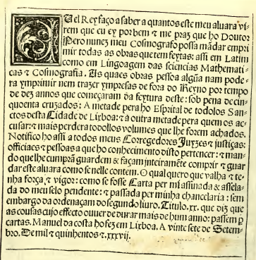

# HSMS Facsimile Typography and Visual Fidelity

How to **represent HSMS diplomatic markup** so the on-screen leaf reads as a faithful visual and aesthetic analogue of the original parchment or printed page — without confusing the transcription layer with a modern edition.

> **Markup authority:** [HSMS *Manual of Manuscript Transcription*](https://hispanicseminary.org/manual-en.htm) · [docs/HSMS-manual.md](HSMS-manual.md)  
> **Spatial coordinates (AST, columns, baselines):** [HSMS-LAYOUT.md](HSMS-LAYOUT.md)  
> **Editor and export workflows:** [HSMS-EDITOR.md](HSMS-EDITOR.md)  
> **Implementation map:** [ARCHITECTURE.md](ARCHITECTURE.md)

---

## 1. What “faithful” means here

Transcription Conniption is not a typesetting engine for readable modern prose. It is a **facsimile-oriented preview**: each HSMS source line maps to one **physical baseline** on a ruled leaf; tokens carry paleographic and editorial semantics that must remain **visually distinct** on that grid.

Faithfulness has three layers:

| Layer | Question the renderer answers |
|-------|-------------------------------|
| **Spatial** | Does text sit where the scribe or printer placed it — margins, columns, drop-cap box, gloss track, folio break? |
| **Typographic** | Do letterforms, abbreviations, and punctuation occupy believable widths on the baseline (no overlap, no reflow merge)? |
| **Material** | Does the page feel like vellum or early paper — warm ground, ruled frame, rubric ink — rather than a default web paragraph? |

Reading-flow reconstruction (`reconstructPageFlow`) is a **scholarly overlay** for search and synoptic panes. The parchment and SVG facsimile paths intentionally **do not** reflow diplomatic lines to fit the viewport.

---

## 2. Reference witness: printed alvará (Pedro Nunes, 1537)

The canonical visual stress test is the opening of the royal decree on **[fol. 1v]** in `../PedroNunes-TRS/text-TRS.txt` — a single-column incunable page with a historiated initial and fully justified Gothic text.



| Feature on the leaf | HSMS encoding | Facsimile treatment |
|---------------------|---------------|---------------------|
| Square historiated **E** spanning four–five lines | `{IN5.} EU` → cap **E**, body **U el Rey…** | Ornate drop-cap box (`depth × LH`); body lines 2–5 indented (`HtmlCapState` / native cap gutter) |
| **El** as one word | Single grapheme in cap; remainder in body | `parseDropInitialPrefix()` + `stripDropCapPrefixFromSegs()` — never duplicate **E** in justified track |
| Line-end hyphen **vi-** / **rem** | Two source lines; trailing `-` on first | One row per line; hyphen at right margin of row 1 |
| Tironian **et** as `&` | `&` token | Single glyph slot; no collision with following letters |
| Nasal **~** (e.g. **algũa**, **mãdar**) | Tilde on vowel or `o~` | Diplomatic glyphs by default; normalized õ/ã when **Unicode diacritics** toggle is on |
| Long **s** (ſ) | Transcribed as scribal form in source | Rendered literally unless normalized in source |
| Rubric/heading contrast | `{RUB. …}`, `{HD. …}` | Vermilion `#9b2217`, bold (`RUBRIC_FILL`) |
| Justified column | Implicit in `{CB1.}` prose lines | Web: micro-tracking justification inside fixed column width; native: measured line width |

Legacy parity target: `../PedroNunes-TRS/text-TRS.txt_cc-test.htm` (table-row HTML, floated initial). Automated checks: `__tests__/pedroNunesTrsParity.test.ts`, `__tests__/spatialAst.test.ts`.

---

## 3. Material aesthetics (the parchment surface)

Early modern leaves are read as **objects**, not as reflowable articles.

### 3.1 Ground and frame

| Constant / theme | Value | Role |
|------------------|-------|------|
| `PARCHMENT_BG` | `#f4ebd0` | Facsimile canvas fill (`pageLayout.ts`) |
| `RULE_STROKE` | `#dfd3b6` | Margin and column ruling |
| `scriptoriumTheme.parchment` | `#f5ebd0` | App parchment chrome |
| `CANVAS_W` | `800` px | Fixed logical page width — grid does not shrink on narrow phones |

The SVG facsimile draws **lead-point-style rules** at `MARGIN`, column boundaries, and baseline bands so the eye reconstructs the writing area the way a ruled quire or printed forme implies.

### 3.2 What stays off the leaf

| Content | Placement |
|---------|-----------|
| `{RMK: …}` bibliographic lines | Publication card above the scroll view only |
| Validation / linter banners | Editor chrome, not painted on the facsimile |
| KWIC, TEI, batch issue logs | Export and analysis tools — not facsimile layers |

Stripping metadata leaks from the printable body (`stripRmkFromLine`, `getPrintableBlocks`) keeps the parchment visually identical to what a reader would see on the physical side.

---

## 4. Typographical systems

HSMS transcriptions may represent **manuscript hands**, **incunable or early print**, or hybrid witnesses. The renderer uses a **diplomatic serif stack** at `FS = 16` / `LH = 24` rather than attempting historical font licensing for every script — but **spacing discipline** and **token-level styling** carry the scholarly reading.

### 4.1 Manuscript vs print (design expectations)

| Trait | Manuscript tendency | Early print (e.g. alvará) | Renderer stance |
|-------|---------------------|---------------------------|-----------------|
| Line rhythm | Irregular leading, sometimes crowded | Regular horizontal lines, often justified | **Fixed `LH` per HSMS row** |
| Initials | Painted or pen-flourished | Woodcut or type block in a square | `{INn.}` depth box + optional uploaded scan / ornate SVG |
| Abbreviations | Tildes, superscripts, `<<…>>` | Same family of marks in 16th-c. Portuguese | Superscript segments do not expand line height |
| Rubrics | Red ink, smaller capitals | Display type or rubricated capitals | `RUBRIC_FILL`, bold |
| Damage | Stains, holes | Foxing, ink spread | Optional leaf scan on `FolioFacsimileCanvas`; transcription lacunae as tokens |

### 4.2 Baseline integrity

Every token that carries ink on a line must participate in **one baseline advance**:

- **Do not** wrap a single HSMS row onto a second baseline inside the facsimile (viewport reflow breaks calderones, `%2` wrap-back, and `{INn.}` gutters).
- **Do** extend horizontal scroll when a diplomatic line is longer than the column — the witness is wider than the phone, not wrong.

### 4.3 Justification and hyphenation

Fully justified incunable columns (see reference image) are approximated on web by **letter-spacing micro-tracking** within the fixed column width from `pageLayout.ts`. Hyphens transcribed at line ends (`vi-` + next line `rem`) are **not** removed in facsimile mode: they document **where the compositor broke the line**, not how a modern editor would hyphenate a paragraph.

---

## 5. HSMS markup → visual treatment

This table is the **aesthetic contract** implemented in `components/svgFacsimile/tokenRendering.ts` and mirrored (simplified) in React Native `TokenStream`.

### 5.1 Structural and spatial mnemonics

| Mnemonic | Visual role |
|----------|-------------|
| `[fol. …]` | Folio break — new leaf section in scroll; not inline prose |
| `{CB1.}` / `{CB2.}` | Column envelope — width and zip rules per [HSMS-LAYOUT.md](HSMS-LAYOUT.md) |
| `{INn.} L…` | Drop-cap **box** depth `n`; **one** historiated grapheme `L` in cap; opening word remainder in body |
| `{HD. …}` | Running header — above body band |
| `{CW.}`, `{SG.}` | Catchword / signature — below body |
| `{GLR.}`, `{GLL.}`, … | Gloss track — smaller italic purple (`GLOSS_FILL`) |
| `{DIAG.}` | Reserved diagram band |
| `{ILL.}`, `{MIN.}` | Figure anchors — placeholder or uploaded facsimile slot |
| Line prefix `1 `, `cxxxi ` | Margin line number channel (when enabled in layout) |

### 5.2 Paleographic and editorial tokens

| Token type | Diplomatic facsimile | Scholarly toggle behaviour |
|------------|----------------------|----------------------------|
| `text` | Body ink `#1a0a05` (or rubric/gloss/foreign overrides via `envLayers`) | — |
| `expansion` `q<ue>` | Hidden, or brown italic superscript when **Expansions** on | Does not reset line origin |
| `scribal_deletion` | `(<del>)` strikethrough faint when **Deletions** on | — |
| `editorial_deletion` | Strikethrough brown | — |
| `scribal_insertion` | Green `/…\_` | — |
| `editorial_insertion` | Brown italic `[…]` | — |
| `reconstructed_text` `[*…]` | Green italic brackets | Signals supplied text, not ink |
| `illegible_text` | Faint □□ | — |
| `missing_fragment` | Faint ellipsis … | — |
| `mechanical_lacuna` `[ ]` | Word-space gap (preserves word boundaries) | Distinct from bare `[]` |
| `otiose_mark` | Faint `~` | Hidden when **Otiose marks** suppressed |
| `citation_wrap` `%…%` | Faint italic | `%2` wrap-back anchored to prior line (web overlay) |
| `scribal_punctuation` `$;` `$。` | Rubric-coloured punctuation | — |
| `calderon` / `¶¶¶` | Rubric paragraph marks | Spatial anchors, not reflow breaks |
| `&` (Tironian et) | Single character width | Critical for Portuguese incunable parity |

### 5.3 Colour semantics (facsimile palette)

Colours encode **function**, not decoration:

| Fill | Hex | Meaning |
|------|-----|---------|
| `PROSE_FILL` | `#1a0a05` | Main text ink |
| `RUBRIC_FILL` | `#9b2217` | Rubrics, headings, some punctuation |
| `GLOSS_FILL` | `#4a3060` | Marginal gloss |
| `FOREIGN_FILL` | `#1a3a5a` | Latin or other language spans |
| `INSERT_FILL` | `#2a6e22` | Supplied / reconstructed material |
| `EDITORIAL_FILL` | `#7a5500` | Modern editorial overlay |
| `FAINT_FILL` | `#a08060` | Illegible, citation wrap, deletions |

Nested `{RUB.}` / `{LAT.}` on the same physical line tint tokens via `envLayers` **without splitting the row** — matching how rubrication sits on the same baseline as black ink in the manuscript.

---

## 6. Drop initials: spatial and typographic unity

Drop caps are the hardest fusion of **typography** and **layout** because they violate simple left-to-right flow.

### 6.1 Encoding rules (visual consequences)

```text
{IN5.} EU el Rey fac'o saber…
{IN4.} AO muyto circumspecto…
{IN4.} SPhera mundi…
```

| Input | Cap box | First body line must begin with |
|-------|---------|----------------------------------|
| `{IN5.} EU` | 5 × `LH` tall | **U** el Rey… (not **E** again) |
| `{IN4.} AO` | 4 × `LH` | **O** muyto… |
| `{IN4.} SPhera` | 4 × `LH` | **Phera**… |

The historiated letter is **one grapheme** (`utils/dropInitial.ts`). Multi-letter cap strings in the box (e.g. `[AE]` editorial supply) widen via `dropCapBoxWidth(capH, letterCount)`.

### 6.2 Ornate initial style matrices (native SVG)

`renderOrnateInitialSvg` (`components/svgFacsimile/renderOrnateInitial.tsx`) picks a **deterministic** variant from `buildDropCapSeed(folioId, letter, blockIndex)` via `seededRng` (`dropInitialLetterform.ts`). Each witness location gets a stable combination of **field colour** (from `ILLUMINATED_THEMES`), **font stack**, and **background doodles** clipped to the inner panel (8% pad) so vines and hatch lines do not bleed into adjacent lines.

| Style | Name | Background | Typography |
|-------|------|------------|------------|
| 0 | Historiated vines | Acanthus curves and leaf nodes | Lombardic serif stack |
| 1 | Geometrical criblé | Gold stipple on deep field | Heavy Gothic (`fontWeight: 900`) |
| 2 | Renaissance ribbon | Double-ruled interlace bands | Palatino / Garamond Roman |
| 3 | Minstrel damask | Checkerboard or cross-hatch tessellation | Calligraphic serif stack |

Tap the cap box to replace the procedural design with a **localized folio scan** (`uploadedUri`); border and hit target are preserved. Web facsimile rows use the parallel `HtmlOrnateDropCap` component inside HTML `ForeignObject` cells.

### 6.3 Rendering checklist

1. Cap renders in the sunken box (ornate SVG, or user scan).
2. First body line’s segments are stripped of the duplicated cap grapheme (`stripDropCapPrefixFromSegs`).
3. Lines `2 … n` receive left padding equal to **box width + `CAP_GUTTER`** until depth is exhausted.
4. `{ILL.}` / `{MIN.}` inside `{IN.}` may occupy the cap region per manual §3.232.

Failure mode to avoid: peeling the entire particle **AO** into the cap so **O** disappears from the body — the facsimile then disagrees with both the printed page and the HSMS line.

---

## 7. Diacritics, abbreviations, and special characters

| Source pattern | Diplomatic display | Normalized display (toggle) |
|----------------|-------------------|-----------------------------|
| `a~`, `o~`, `c'o~` | Tilde visible on baseline | ã, õ, çõ via `normalizeDisplayDiacritics` |
| `q<ue>`, `fac'<o>` | Angle brackets / apostrophe marks | Expanded or suppressed per **Expansions** |
| `<<rum>>`, `<er>` | Superscript abbreviation | Raised smaller segment (`super: true`) |
| `&` | Tironian et glyph | Never two glyphs |
| `~` alone (otiose) | Faint tilde | Optional hide |

**Principle:** toggles change **how much markup is visible**, not **where** the line sits on the grid.

---

## 8. Two render paths: when aesthetics diverge

| Path | Use | Fidelity profile |
|------|-----|------------------|
| **SVG facsimile** (`SvgFacsimilePage*`) | Default when **SVG canvas** enabled | Highest spatial parity — fixed canvas, drop caps, `{CB2.}` zip, justification (web) |
| **RN parchment** (`TokenStream`, `BlockFigureLayout`) | Fast preview without SVG | Left-aligned prose; same token colours; drop cap as large rubric bold — **not** the incunable justification target |
| **Legacy HTML export** (`htmlExport.ts`) | Batch `out/*.html` | Table-row parity with `HSMSTranscription2HTML` |

For publication screenshots or TRS comparison, prefer **SVG facsimile on web**. For field editing on device, RN parchment confirms tokenization; switch to SVG before judging line breaks and caps.

Optional **folio leaf scan** (`FolioFacsimileCanvas`) places the diplomatic grid over a photograph of the real leaf — the strongest material fidelity when a bitmap is available.

---

## 9. Display toggles and layers of truth

`ReaderStateContext` toggles define **which inks are visible**, not **where they sit**:

| Toggle | Aesthetic intent |
|--------|------------------|
| Expansions `<>` | Show scribal/supplied letters the manuscript compresses |
| Deletions `()` | Show struck or bracketed removal |
| Unicode diacritics | Modern normalized vowels for readers unfamiliar with tildes |
| Otiose `~` | Hide mechanical tildes that are not phonemic |
| Reading flow | Reconstruct continuous text in synoptic pane only |
| SVG canvas | Enable fixed-grid facsimile renderer |

Defaults favour a **clean diplomatic leaf** (expansions and deletions off, tildes visible) for first impression; scholars enable layers as needed.

---

## 10. Quality checklist before calling a page “faithful”

Use this list beside the printed or manuscript facsimile (or `text-TRS.txt_cc-test.htm`):

- [ ] One screen row per HSMS source line (no internal wrap).
- [ ] `{INn.}` depth matches letter count on the original (e.g. five-line **E** on 1v).
- [ ] Opening word complete after cap (**U** el Rey, not **el Rey** alone).
- [ ] Line-end hyphens visible at margin; continuation line aligns to same column.
- [ ] Rubric lines visibly distinct from body ink.
- [ ] `[*…]`, `??`, `[ ]`, `[]` each have distinct glyphs (see `__tests__/hsmsPaleography.test.ts`).
- [ ] `{RMK:}` never appears inside the parchment column.
- [ ] `{CB2.}` rows zip left/right; gloss does not collapse into main prose width.
- [ ] Tironian `&` does not overlap following letters at common sizes.
- [ ] Parchment background and margin rules visible; horizontal scroll acceptable for long lines.

---

## 11. Intentional limits

| Limit | Reason |
|-------|--------|
| No licensed Blackletter webfont per witness | Legal and bundle size; spacing + caps carry parity |
| Ornate cap is generative SVG unless user uploads scan | Four seeded matrices on native; web uses `HtmlOrnateDropCap`; TRS uses maroon float in legacy HTML |
| RN path not fully justified | React Native `Text` does not implement incunable letter-spacing model |
| Zoom ≠ reflow | Zoom scales pixels; baselines remain tied to source lines |
| Stains and foxing | Only via background scan overlay, not simulated per token |

Future work (see [ARCHITECTURE.md](ARCHITECTURE.md) roadmap): image pane in synoptic view, deeper font pairing per script, print-specific justification metrics derived from facsimile metrology.

---

## 12. Related implementation files

| File | Typography / aesthetics |
|------|-------------------------|
| `components/svgFacsimile/tokenRendering.ts` | `FS`, `LH`, fills, `tokenToSegs`, paleographic cases |
| `components/svgFacsimile/pageLayout.ts` | `PARCHMENT_BG`, margins, `dropCapBoxWidth` |
| `components/svgFacsimile/HtmlOrnateDropCap.tsx` | Web historiated cap geometry |
| `components/svgFacsimile/renderOrnateInitial.tsx` | Native historiated cap (`renderOrnateInitialSvg`) |
| `components/svgFacsimile/dropInitialLetterform.ts` | `seededRng`, `ILLUMINATED_THEMES`, matrix fonts |
| `utils/dropInitial.ts` | `{INn.}` grapheme peel |
| `utils/renderMarkupLeakage.ts` | Post-export HTML leakage (batch omits lacuna `[ ]` checks) |
| `utils/hsmsLexer.ts` | Bracket and lacuna token boundaries |
| `constants/scriptoriumTheme.ts` | App-wide vellum palette |
| `utils/htmlExport.ts` | Legacy floated-cap HTML |

---

## 13. Further reading

- Mackenzie & Harris-Northall, *A Manual of Manuscript Transcription* — §3.232 Initials, §3.226 Editorial procedures, §3.12 Word division.
- [OSTA transcription guide](https://hispanicseminary.org/osta-en.htm) — corpus-specific paleographic conventions.
- [HSMS-LAYOUT.md](HSMS-LAYOUT.md) — AST, `{CB.}` zip, baseline grid, parity tests.
- Transcription Conniption: `npm test` (158 tests) · Pedro Nunes: `npx jest __tests__/pedroNunesTrsParity.test.ts`

---

*This document describes visual design intent for Transcription Conniption. Transcription rules remain authoritative in the [HSMS manual](https://hispanicseminary.org/manual-en.htm). © 1997 Hispanic Seminary of Medieval Studies, Ltd.*
